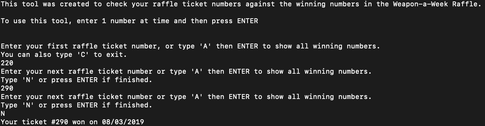
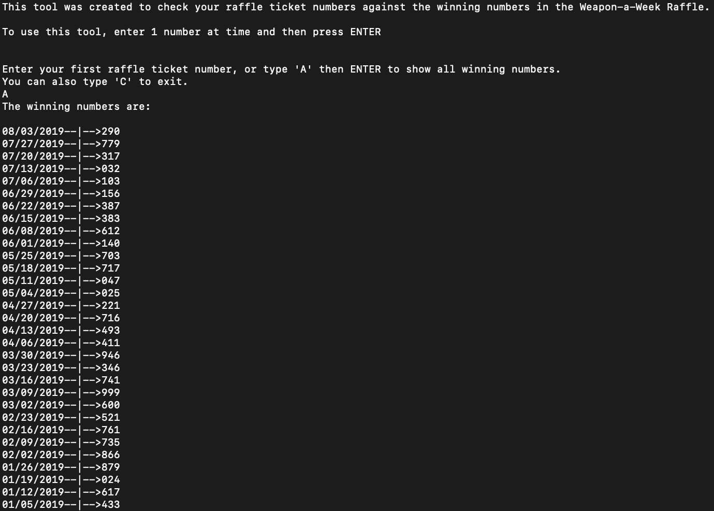

## Raffle Ticket Checker

This project is a simple raffle ticket checker using Selenium WebDriver and Python 3.
The project checks the numbers of the Michigan Lotto Daily 3 evening drawing, and scrapes the dates for the Saturday drawing.  I used python Pandas to process the csv file into a DataFrame, then used the datetime.datetime library to select the dates that fall on Saturday.

This project can be modified to scrape other websites for a similar use.  

#### Usage:
To use this project, make sure Chrome is installed on your machine. After, install the ChromeDriver into your path.
* Clone the git repository to your local directory:

```
git clone git@github.com:cjcrist/Raffle_Ticket_Checker.git
```

* Move the chromedrive to /usr/local/bin. On OSx or linux:
    * Drivers for other web browsers can be downloaded [here](https://www.seleniumhq.org/download/)

```
mv chromedriver /usr/local/bin/.
```

* If using different browser, you need to modify the driver and options in the search_dates() function to match your browser.

```
def search_dates(url, date):
    options = webdriver.ChromeOptions()
    prefs = {"download.default_directory": os.getcwd()}
    options.add_experimental_option("prefs", prefs)
    driver = webdriver.Chrome(options=options)
```

* Install requirements.txt:

```
pip3 install -r requirements.txt
```

* From your project directory, run the Raffle_Checker.py using python 3.

```
python3 ./Raffle_Checker.py
```

**Image of a winning raffle number:**




**Image of all winning raffle numbers this year:**




* You can use this project, as it is, to get a feel for the functionality, but will need to modify the site url, and the following lines of code to fit the site your are scraping.

```
date_selector = driver.find_element_by_class_name("date-range-container ")
start_date = date_selector.find_element_by_id("startDateId")
end_date = date_selector.find_element_by_id("endDateId")
end_date.send_keys(date)
button = driver.find_element_by_class_name("msl-button.msl-button-green")
button.send_keys(Keys.ENTER)
download = driver.find_element_by_xpath('//*[@id=\"pagination-element-top\"]/div/div[1]/a')
download.send_keys(Keys.ENTER)
```

Watch this video for a demo:
[Raffle-Ticket-Checker-Full-Demo.mp4](demo/Raffle-Ticket-Checker-Full-Demo.mp4)
